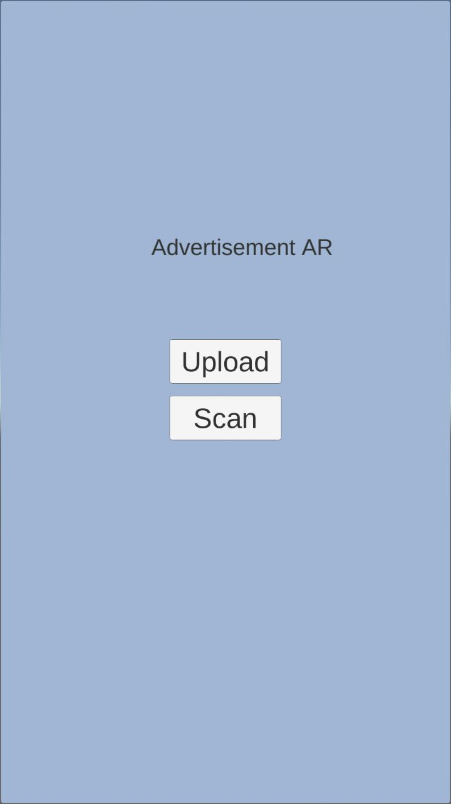
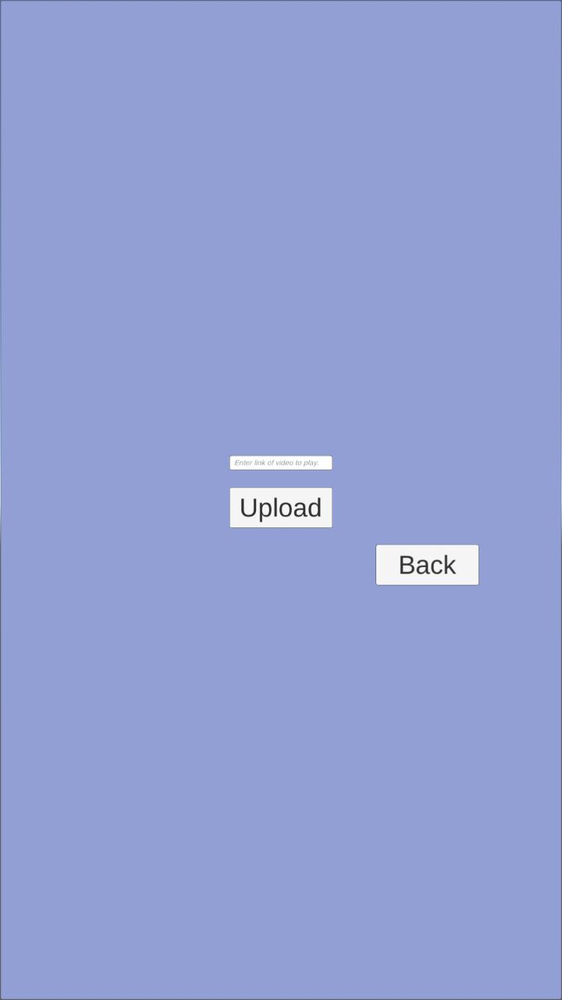
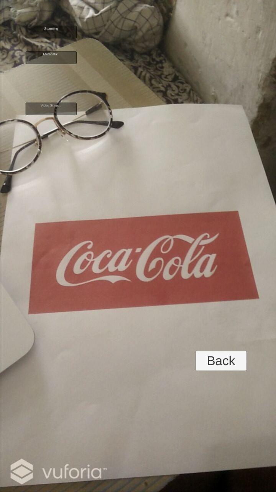
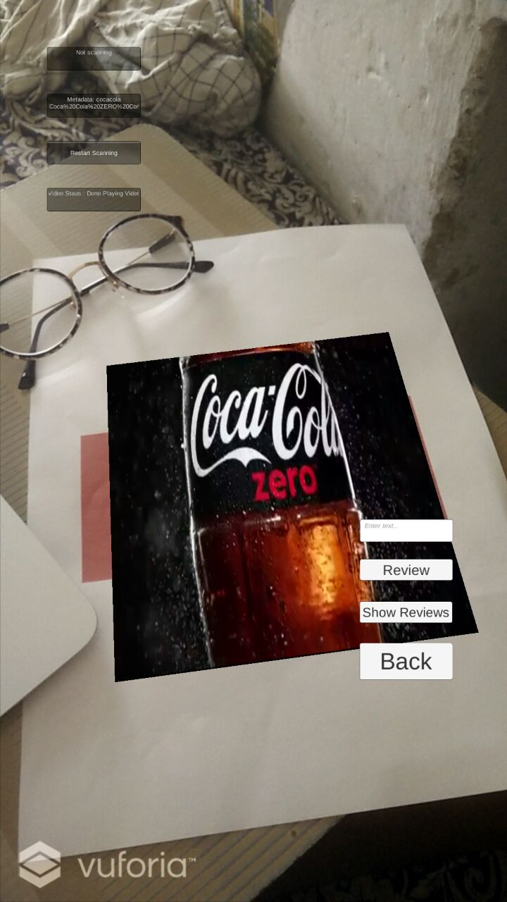
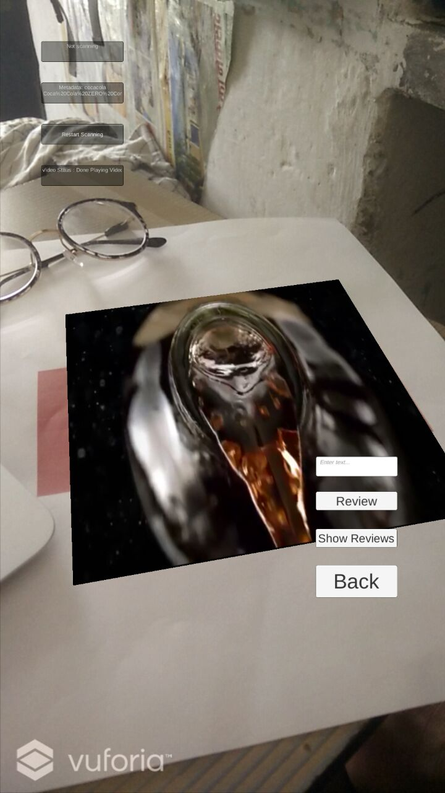

<h1 align="center"> Advertisement AR </h1>  

  

# Table Of Contents

- [Introduction](#introduction)
- [Features](#features)
- [Demo](#demo)
- [Feedback](#feedback)
- [Contributors](#contributors)
- [Contribute](#contribute)
- [Acknowledgement](#Acknowledgements)

# Introduction

 
 

With this android application we try to change the way advertising is done. We take a step to moving from static advertisements to virtual, dynamic advertisements, with the help of augmented reality. Yearly, millions and billions of dollars are wasted on printing advertisement hoardings. If we could just make the advertisements virtual and print only once, then we could save a lot of resources. Moreover, virtual advertisements have the advantage of being more appealing to the eye. Also, they can portray the product better, with its full 3D image. The real properties of the product can be seen by the users. In this application, users can scan images with their mobile phone or an augmented reality capable device and view the video linked to that image, in augmented reality, on top of the image itself. Advertisers on the other hand can upload images and the link to the video, to a cloud database which is scanned each time a user tries to view advertisements.

# Features

* Advertisers can upload pictures and links related to them to the cloud database.
* Customers can view the advertisements with the android application
* Customer can review the product 
* Global reviews that can be viewed by all users

# Screenshots

# Feedback
Feel free to send us feedback on [Email](mailto:avisheksanvas@gmail.com) or [file an issue](https://github.com/avisheksanvas/AdvertisementAR/issues).

# Contributors

<ul>
  <li> <a href="https://github.com/aman-1208">Aman Gangwar</a></li>
  <li> <a href="https://github.com/avisheksanvas">Avishek Sanvas</a></li>
  <li> <a href="https://github.com/ts49">Ashish Kumar</a></li>
</ul>

# Contribute

<ul>
  <li>Feel free to report issues and bugs.It will be helpful for future launches of application.</li>
  <li>All Suggestions are welcome.</li>
  <li>Fork repository and Contribute.</li>
</ul>

# Acknowledgement

<ul>
  <li>Thanks to <a href="https://unity3d.com">Unity</a> for providing their platform.</li>
  <li>Thanks to <a href="https://www.vuforia.com">Vuforia</a> for providing their SDK for Unity.</li>
  <li>Thanks to <a href="https://firebase.google.com">Firebase</a> for providing their API.</li>
</ul>

Built with <strong><3</strong>
